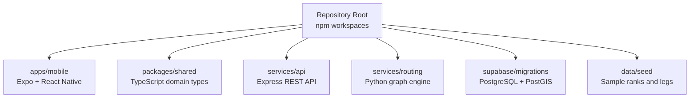
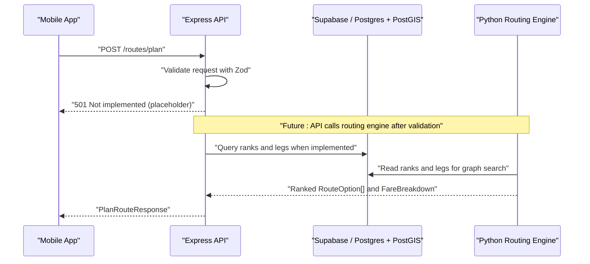
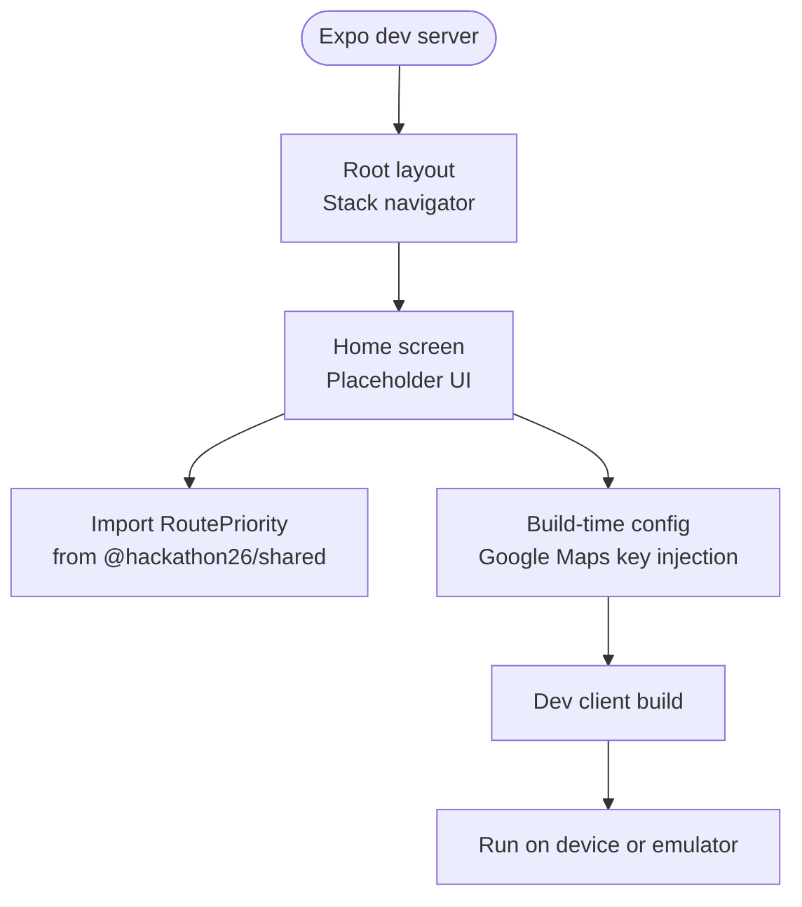
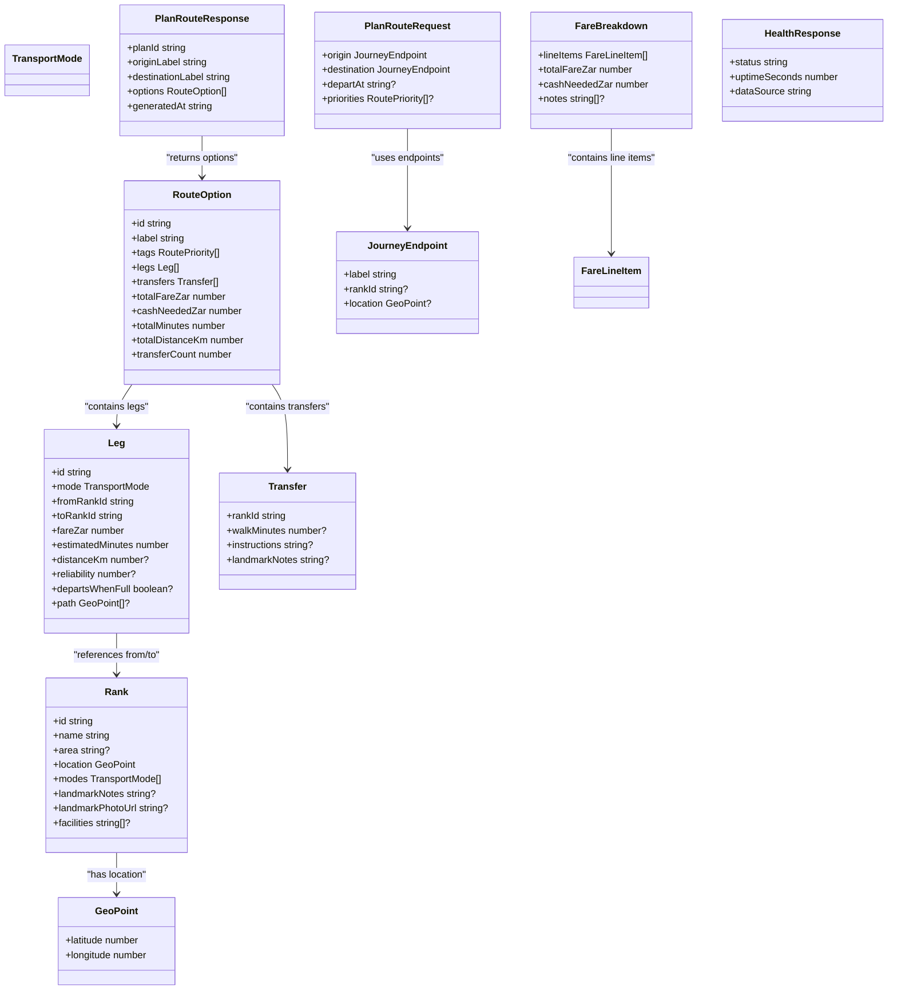
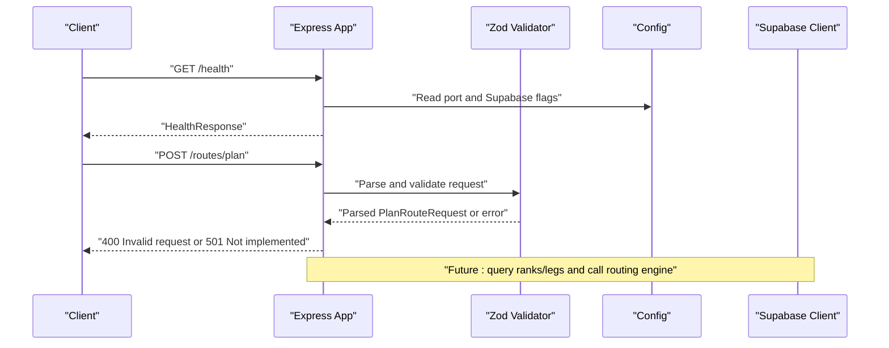
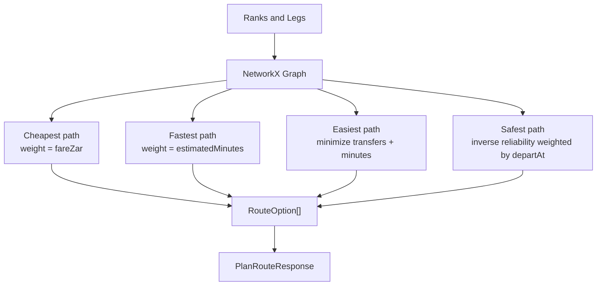
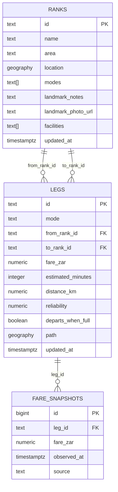
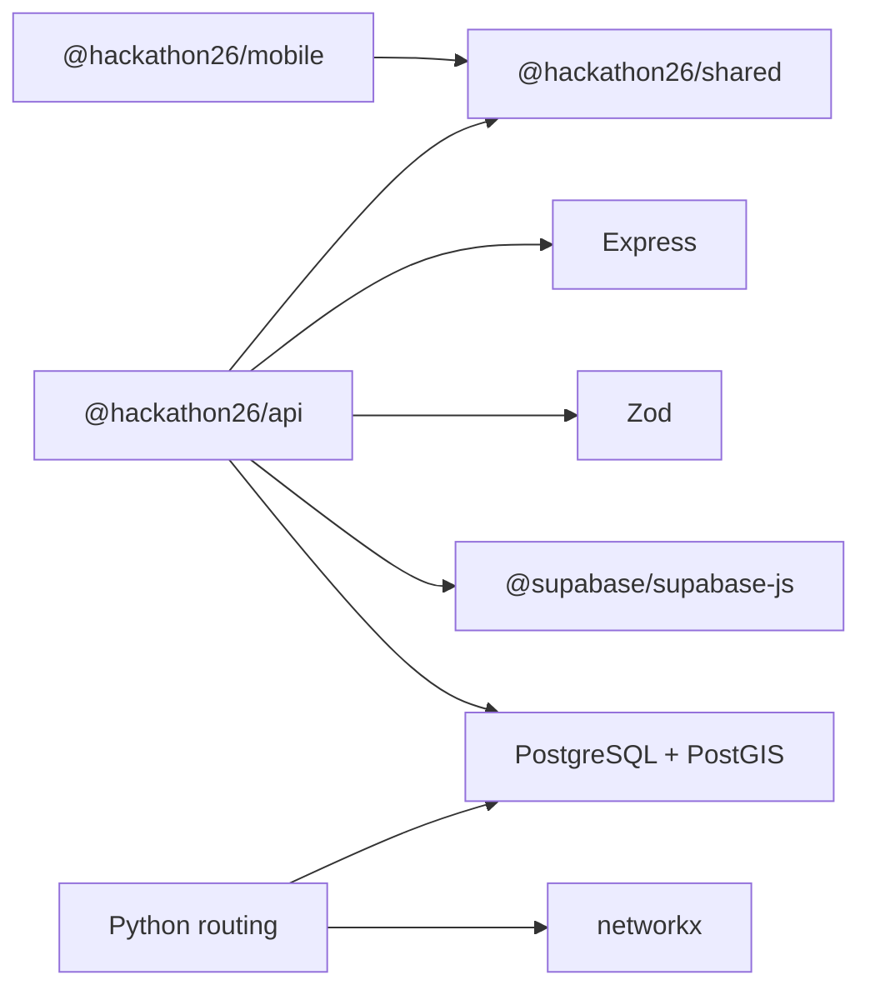

# Architecture Overview

<cite>
**Referenced Files in This Document**
- [README.md](file://README.md)
- [ARCHITECTURE.md](file://docs/ARCHITECTURE.md)
- [package.json](file://package.json)
- [apps/mobile/package.json](file://apps/mobile/package.json)
- [apps/mobile/app.config.ts](file://apps/mobile/app.config.ts)
- [apps/mobile/src/app/_layout.tsx](file://apps/mobile/src/app/_layout.tsx)
- [apps/mobile/src/app/index.tsx](file://apps/mobile/src/app/index.tsx)
- [packages/shared/package.json](file://packages/shared/package.json)
- [packages/shared/src/index.ts](file://packages/shared/src/index.ts)
- [services/api/package.json](file://services/api/package.json)
- [services/api/src/index.ts](file://services/api/src/index.ts)
- [services/api/src/config.ts](file://services/api/src/config.ts)
- [services/api/src/db.ts](file://services/api/src/db.ts)
- [services/routing/pyproject.toml](file://services/routing/pyproject.toml)
- [supabase/migrations/0001_init.sql](file://supabase/migrations/0001_init.sql)
</cite>

## Table of Contents
1. [Introduction](#introduction)
2. [Project Structure](#project-structure)
3. [Core Components](#core-components)
4. [Architecture Overview](#architecture-overview)
5. [Detailed Component Analysis](#detailed-component-analysis)
6. [Dependency Analysis](#dependency-analysis)
7. [Performance Considerations](#performance-considerations)
8. [Troubleshooting Guide](#troubleshooting-guide)
9. [Conclusion](#conclusion)

## Introduction
TransitGuide is a full-stack monorepo that helps first-time long-distance public transport commuters plan predictable trips. The system combines:
- An Expo/React Native mobile app for user input and route visualization.
- An Express.js REST API that validates requests, owns routing logic, and talks to the database.
- A Python graph search engine intended to compute ranked journeys over ranks and legs.
- A PostgreSQL database with PostGIS for spatial queries such as finding nearby ranks.
- A shared TypeScript domain types package ensuring consistent contracts between the mobile app and backend services.

The product focuses on practical commuter needs: identifying boarding ranks, transfer points, costs, cash requirements, and visual landmarks at each step.

**Section sources**
- [README.md:1-10](file://README.md#L1-L10)
- [ARCHITECTURE.md:3-13](file://docs/ARCHITECTURE.md#L3-L13)

## Project Structure
The repository uses npm workspaces to manage multiple packages from one root:
- `apps/mobile`: Expo Router application with React Native screens.
- `packages/shared`: Types-only package defining the domain model and request/response shapes.
- `services/api`: Express server exposing `/health` and `/routes/plan`.
- `services/routing`: Python package using NetworkX for graph-based journey ranking.
- `supabase/migrations`: Database schema and PostGIS functions.
- `data/seed`: Sample rank and leg data for local development.

**Diagram sources**
- [package.json:6-10](file://package.json#L6-L10)
- [README.md:121-131](file://README.md#L121-L131)

**Section sources**
- [package.json:1-28](file://package.json#L1-L28)
- [README.md:121-131](file://README.md#L121-L131)

## Core Components
The five main components are:
- Mobile app: User interface, navigation, and map rendering via Expo Router and `react-native-maps`.
- Shared types: Domain model including `Rank`, `Leg`, `RouteOption`, `PlanRouteRequest`, and `PlanRouteResponse`.
- API service: Express server with Zod validation, Supabase client wiring, and health endpoint.
- Routing engine: Python package prepared for multi-objective shortest-path computation using NetworkX.
- Database layer: PostgreSQL with PostGIS, including tables for ranks, legs, fare snapshots, and a nearest-rank function.

Key responsibilities:
- Mobile app consumes shared types and calls the API; it does not talk directly to Supabase for routing.
- API validates inputs, returns structured errors, and will integrate with the routing engine and database.
- Routing engine computes ranked routes based on cost, time, transfers, and reliability.
- Database stores spatial and temporal transit data and supports efficient geographic queries.

**Section sources**
- [ARCHITECTURE.md:14-24](file://docs/ARCHITECTURE.md#L14-L24)
- [packages/shared/src/index.ts:10-143](file://packages/shared/src/index.ts#L10-L143)
- [services/api/src/index.ts:1-81](file://services/api/src/index.ts#L1-L81)
- [services/routing/pyproject.toml:1-25](file://services/routing/pyproject.toml#L1-L25)
- [supabase/migrations/0001_init.sql:1-105](file://supabase/migrations/0001_init.sql#L1-L105)

## Architecture Overview
At runtime, the mobile app sends route planning requests to the API. The API validates requests using Zod and typed against shared domain types. In the current implementation, `/routes/plan` validates successfully but returns a 501 placeholder while the routing engine is integrated later. The database layer provides ranks, legs, and spatial capabilities through PostGIS.

**Diagram sources**
- [ARCHITECTURE.md:26-38](file://docs/ARCHITECTURE.md#L26-L38)
- [services/api/src/index.ts:35-67](file://services/api/src/index.ts#L35-L67)
- [supabase/migrations/0001_init.sql:8-47](file://supabase/migrations/0001_init.sql#L8-L47)

## Detailed Component Analysis

### Mobile App (Expo + React Native)
The mobile app is an Expo Router application with file-based routing under `src/app/`. The root layout defines a Stack navigator and a placeholder home screen. It imports `RoutePriority` from the shared types package to prove workspace type sharing works. Maps use `react-native-maps`; Android requires a Google Maps API key injected at build time via `app.config.ts`. iOS uses Apple Maps without a key.

**Diagram sources**
- [apps/mobile/src/app/_layout.tsx:1-18](file://apps/mobile/src/app/_layout.tsx#L1-L18)
- [apps/mobile/src/app/index.tsx:1-65](file://apps/mobile/src/app/index.tsx#L1-L65)
- [apps/mobile/app.config.ts:1-64](file://apps/mobile/app.config.ts#L1-L64)

Technology decisions:
- Expo was chosen because SDK 52+ handles monorepo Metro bundling automatically, avoiding manual `metro.config.js` configuration.
- `react-native-maps` was selected over the alpha `expo-maps` for stability during the hackathon.
- React versions are pinned via root `overrides` to avoid duplicate React copies caused by web dependencies.

**Section sources**
- [apps/mobile/package.json:1-32](file://apps/mobile/package.json#L1-L32)
- [apps/mobile/src/app/_layout.tsx:1-18](file://apps/mobile/src/app/_layout.tsx#L1-L18)
- [apps/mobile/src/app/index.tsx:1-65](file://apps/mobile/src/app/index.tsx#L1-L65)
- [apps/mobile/app.config.ts:1-64](file://apps/mobile/app.config.ts#L1-L64)
- [README.md:91-119](file://README.md#L91-L119)
- [ARCHITECTURE.md:76-108](file://docs/ARCHITECTURE.md#L76-L108)

### Shared Types Package
The shared package exports TypeScript interfaces and enums used by both the mobile app and the API. It is intentionally types-only so no runtime code crosses the workspace boundary. Key types include:
- `TransportMode`, `GeoPoint`
- `Rank`, `Leg`, `Transfer`
- `RoutePriority`, `RouteOption`, `FareLineItem`, `FareBreakdown`
- `JourneyEndpoint`, `PlanRouteRequest`, `PlanRouteResponse`
- `HealthResponse`

This package ensures consistency across layers and prevents request/response shape drift.

**Diagram sources**
- [packages/shared/src/index.ts:10-143](file://packages/shared/src/index.ts#L10-L143)

**Section sources**
- [packages/shared/package.json:1-19](file://packages/shared/package.json#L1-L19)
- [packages/shared/src/index.ts:1-143](file://packages/shared/src/index.ts#L1-L143)
- [ARCHITECTURE.md:43-58](file://docs/ARCHITECTURE.md#L43-L58)

### API Service (Express + Zod + Supabase Client)
The API exposes:
- `GET /health`: Returns status, uptime, and configured data source.
- `POST /routes/plan`: Validates the request body using Zod against the shared domain types, then currently returns a 501 placeholder.

Configuration is read once at boot from environment variables. The Supabase client is created only when credentials exist, allowing the API to run locally without a live database.

**Diagram sources**
- [services/api/src/index.ts:1-81](file://services/api/src/index.ts#L1-L81)
- [services/api/src/config.ts:1-13](file://services/api/src/config.ts#L1-L13)
- [services/api/src/db.ts:1-17](file://services/api/src/db.ts#L1-L17)

Validation and error handling:
- Zod schemas enforce required fields, valid enum values, and optional parameters.
- Validation failures return a 400 response with structured issues.
- Unimplemented features return 501 responses with descriptive messages.
- Unknown routes return 404 responses.

**Section sources**
- [services/api/package.json:1-29](file://services/api/package.json#L1-L29)
- [services/api/src/index.ts:1-81](file://services/api/src/index.ts#L1-L81)
- [services/api/src/config.ts:1-13](file://services/api/src/config.ts#L1-L13)
- [services/api/src/db.ts:1-17](file://services/api/src/db.ts#L1-L17)

### Routing Engine (Python + NetworkX)
The routing engine is a Python package designed to perform multi-objective shortest-path searches over the transit network. It depends on NetworkX and is prepared for development testing with pytest. Ranking strategies include cheapest, fastest, easiest, and safest, each applying different edge weights over the same graph.

**Diagram sources**
- [ARCHITECTURE.md:60-73](file://docs/ARCHITECTURE.md#L60-L73)
- [services/routing/pyproject.toml:1-25](file://services/routing/pyproject.toml#L1-L25)

**Section sources**
- [ARCHITECTURE.md:60-73](file://docs/ARCHITECTURE.md#L60-L73)
- [services/routing/pyproject.toml:1-25](file://services/routing/pyproject.toml#L1-L25)

### Database Layer (PostgreSQL + PostGIS)
The database schema includes:
- `ranks`: Boarding/alighting locations with spatial geography and metadata.
- `legs`: Directed hops between ranks with fares, durations, reliability, and optional geometry paths.
- `fare_snapshots`: Historical fare observations per leg.
- Spatial index on `ranks.location` and indexes on leg foreign keys.
- A SQL function `ranks_within(lat, lng, radius_meters)` returning nearby ranks ordered by distance.

PostGIS enables efficient spatial queries like “nearest rank to me” without round-tripping every rank to the client.

**Diagram sources**
- [supabase/migrations/0001_init.sql:8-59](file://supabase/migrations/0001_init.sql#L8-L59)

**Section sources**
- [supabase/migrations/0001_init.sql:1-105](file://supabase/migrations/0001_init.sql#L1-L105)

## Dependency Analysis
The monorepo’s dependency relationships are:
- `apps/mobile` depends on `@hackathon26/shared` for domain types.
- `services/api` depends on `@hackathon26/shared`, Express, Zod, and Supabase client.
- `services/routing` is independent of the Node workspace and runs as a Python package.
- The database is external to the Node toolchain but accessed by the API and routing engine.

**Diagram sources**
- [apps/mobile/package.json:1-32](file://apps/mobile/package.json#L1-L32)
- [services/api/package.json:1-29](file://services/api/package.json#L1-L29)
- [services/routing/pyproject.toml:1-25](file://services/routing/pyproject.toml#L1-L25)

**Section sources**
- [apps/mobile/package.json:1-32](file://apps/mobile/package.json#L1-L32)
- [services/api/package.json:1-29](file://services/api/package.json#L1-L29)
- [services/routing/pyproject.toml:1-25](file://services/routing/pyproject.toml#L1-L25)

## Performance Considerations
- Monorepo awareness: Expo SDK 52+ handles Metro bundling for workspaces automatically; avoid manual `watchFolders` or disabling hierarchical lookup.
- Type-only shared package: No runtime overhead from importing shared types; bundler does not resolve another package’s JavaScript.
- PostGIS indexing: Spatial index on `ranks.location` improves nearest-rank queries.
- Supabase free tier: Projects may pause when inactive; warm up before presentations or production usage.
- Duplicate React versions: Root `overrides` pin React and react-dom to prevent conflicting versions pulled by web dependencies.

[No sources needed since this section provides general guidance]

## Troubleshooting Guide
Common operational issues and resolutions:
- OneDrive sync problems: Large `node_modules` and Metro caches cause file locks and slow builds. Move the project outside OneDrive or exclude it from syncing.
- Missing Google Maps key on Android: Without `EXPO_PUBLIC_GOOGLE_MAPS_API_KEY`, Android renders a blank grid. Inject the key at build time via `app.config.ts`.
- Expo Go limitations: `react-native-maps` contains native code; use a development build or cloud build instead of Expo Go.
- Peer dependency warnings: Do not force older `react-native-worklets` versions; let Expo’s dependency graph handle peer ranges.
- Alpha maps library: Avoid switching to `expo-maps` until it stabilizes; stick with `react-native-maps` for now.
- API readiness: `/health` indicates whether Supabase credentials are configured; `/routes/plan` currently returns 501 until the routing engine is wired.

**Section sources**
- [README.md:151-169](file://README.md#L151-L169)
- [README.md:91-119](file://README.md#L91-L119)
- [services/api/src/index.ts:35-67](file://services/api/src/index.ts#L35-L67)

## Conclusion
TransitGuide’s architecture separates concerns cleanly:
- The mobile app owns the user experience and relies on shared types for contract safety.
- The API centralizes validation, routing orchestration, and database access.
- The Python routing engine encapsulates complex graph algorithms.
- PostGIS enables efficient spatial queries essential for real-world transit navigation.
- The types-only shared package guarantees consistency across frontend and backend.

As implementation progresses, the API will transition from placeholders to fully wired routing, fare calculation, and Supabase reads/writes, while keeping the mobile app decoupled from database details.

[No sources needed since this section summarizes without analyzing specific files]