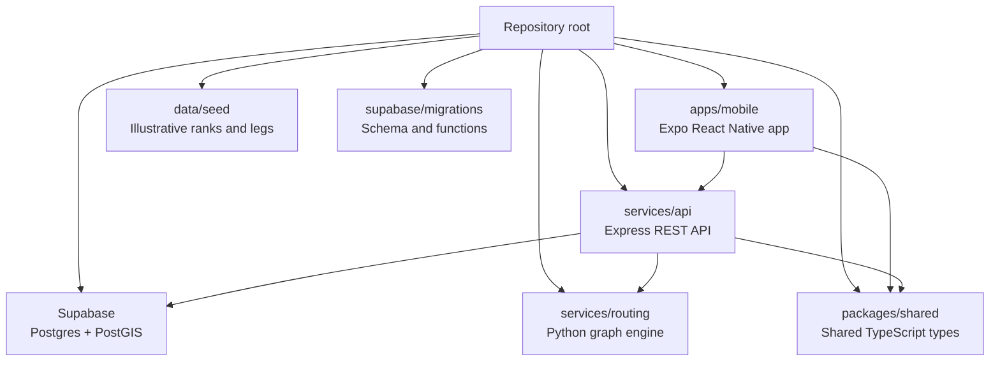
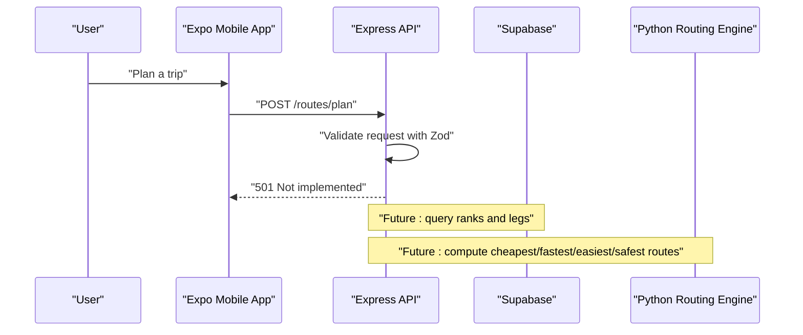
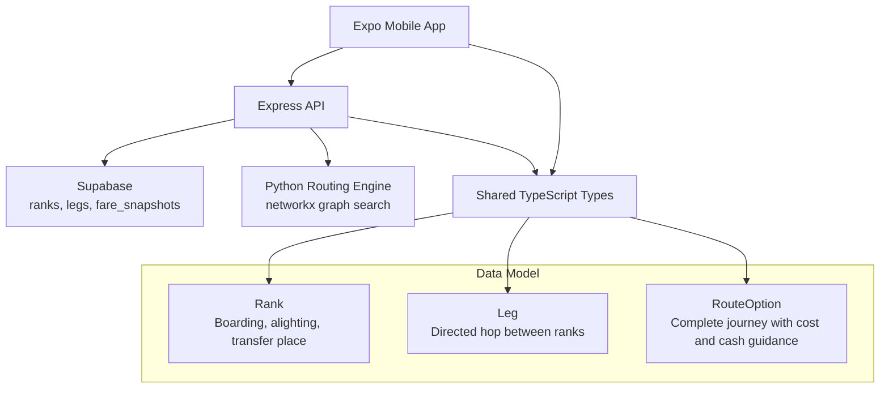

# Getting Started

<cite>
**Referenced Files in This Document**
- [README.md](file://README.md)
- [package.json](file://package.json)
- [apps/mobile/package.json](file://apps/mobile/package.json)
- [services/api/package.json](file://services/api/package.json)
- [services/routing/pyproject.toml](file://services/routing/pyproject.toml)
- [supabase/migrations/0001_init.sql](file://supabase/migrations/0001_init.sql)
- [services/api/src/index.ts](file://services/api/src/index.ts)
- [services/api/src/config.ts](file://services/api/src/config.ts)
- [apps/mobile/app.config.ts](file://apps/mobile/app.config.ts)
- [docs/ARCHITECTURE.md](file://docs/ARCHITECTURE.md)
- [packages/shared/src/index.ts](file://packages/shared/src/index.ts)
- [data/seed/ranks.json](file://data/seed/ranks.json)
- [data/seed/legs.json](file://data/seed/legs.json)
</cite>

## Table of Contents
1. [Introduction](#introduction)
2. [Project Structure](#project-structure)
3. [Prerequisites](#prerequisites)
4. [Installation](#installation)
5. [Environment Configuration](#environment-configuration)
6. [Database Setup](#database-setup)
7. [Sample Data Seeding](#sample-data-seeding)
8. [Python Routing Engine Setup](#python-routing-engine-setup)
9. [Running the API](#running-the-api)
10. [Running the Mobile App](#running-the-mobile-app)
11. [Android Maps and Google Cloud Key](#android-maps-and-google-cloud-key)
12. [API Surface for First-Time Users](#api-surface-for-first-time-users)
13. [Architecture Overview](#architecture-overview)
14. [Troubleshooting](#troubleshooting)
15. [Next Steps](#next-steps)

## Introduction
TransitGuide is a step-by-step navigation app for first-time long-distance public transport commuters in South Africa. It turns uncertain trips into predictable journeys by telling users:
- Which rank to walk to.
- Where to change vehicles.
- What each leg costs.
- How much cash to carry.
- What each transfer point looks like.
- Which route is cheapest, fastest, easiest, or safest.

The project uses an Expo mobile app, an Express API, Supabase with PostGIS, optional Python routing logic, and shared TypeScript types.

**Section sources**
- [README.md:1-10](file://README.md#L1-L10)
- [docs/ARCHITECTURE.md:3-13](file://docs/ARCHITECTURE.md#L3-L13)

## Project Structure
The repository is a monorepo using npm workspaces. The main areas are:
- `apps/mobile`: Expo React Native app.
- `services/api`: Express REST API.
- `services/routing`: Python graph engine (optional).
- `packages/shared`: Shared TypeScript domain types.
- `data/seed`: Illustrative sample ranks and legs.
- `supabase/migrations`: Database schema and functions.
- `docs`: Architecture and product reasoning.

**Diagram sources**
- [docs/ARCHITECTURE.md:14-24](file://docs/ARCHITECTURE.md#L14-L24)
- [package.json:6-10](file://package.json#L6-L10)

**Section sources**
- [docs/ARCHITECTURE.md:14-24](file://docs/ARCHITECTURE.md#L14-L24)
- [package.json:6-10](file://package.json#L6-L10)

## Prerequisites
Before installing anything, prepare your development environment.

| Tool | Version | Why you need it |
| --- | --- | --- |
| Node.js | 20+ (22 recommended) | Runs the app, API, and workspace tooling. |
| npm | 10+ | Installs dependencies across the monorepo. |
| Python | 3.11+ | Sets up the optional routing engine. |
| Android Studio + JDK 17 | Required for local Android builds | Builds the native code used by maps. |
| Supabase account | Free tier is enough | Hosts the ranks, legs, and fare snapshots database. |

The root workspace requires Node 20+. The mobile app depends on Expo SDK 57, React Native 0.86, and `react-native-maps`. The API uses Express, Zod validation, and the Supabase client. The routing engine uses Python and `networkx`.

**Section sources**
- [README.md:12-20](file://README.md#L12-L20)
- [package.json:11-18](file://package.json#L11-L18)
- [apps/mobile/package.json:5-18](file://apps/mobile/package.json#L5-L18)
- [services/api/package.json:13-20](file://services/api/package.json#L13-L20)
- [services/routing/pyproject.toml:1-8](file://services/routing/pyproject.toml#L1-L8)

## Installation
Follow these steps once from the repository root.

1. Open a terminal at the repository root.
2. Install all workspace dependencies:
   - Run `npm install`.
3. Wait for the installation to finish. This installs:
   - The mobile app.
   - The API.
   - The shared package.
   - Development tooling such as TypeScript.

If you already have a working Node.js and npm setup, this command should be enough to bootstrap the JavaScript side of the project.

**Section sources**
- [README.md:24-30](file://README.md#L24-L30)
- [package.json:14-18](file://package.json#L14-L18)

## Environment Configuration
The project uses `.env` files that are gitignored, so secrets do not enter version control.

1. Copy the example environment files:
   - Copy `services/api/.env.example` to `services/api/.env`.
   - Copy `apps/mobile/.env.example` to `apps/mobile/.env`.
2. Create a Supabase project if you do not already have one.
3. From your Supabase project, open **Settings → API**.
4. Copy:
   - `SUPABASE_URL`.
   - `SUPABASE_SERVICE_ROLE_KEY`.
5. Paste both values into `services/api/.env`.
6. For Android maps, add `EXPO_PUBLIC_GOOGLE_MAPS_API_KEY` to `apps/mobile/.env` after setting up Google Cloud.

The API reads its configuration at startup, including the port, Supabase URL, and service role key. If those credentials are missing, the API still starts but reports that it is not connected to Supabase.

**Section sources**
- [README.md:32-41](file://README.md#L32-L41)
- [services/api/src/config.ts:1-13](file://services/api/src/config.ts#L1-L13)
- [apps/mobile/app.config.ts:3-17](file://apps/mobile/app.config.ts#L3-L17)

## Database Setup
The database schema defines ranks, legs, fare snapshots, and a spatial function for finding nearby ranks.

### Option A: Use the Supabase CLI
1. Install the Supabase CLI if you do not already have it.
2. Link your project:
   - Run `npx supabase link --project-ref <your-project-ref>`.
3. Push the migration:
   - Run `npx supabase db push`.

### Option B: Use the Supabase Dashboard SQL Editor
1. Open your Supabase project dashboard.
2. Open the SQL editor.
3. Paste the contents of `supabase/migrations/0001_init.sql`.

The migration:
- Enables PostGIS.
- Creates the `ranks`, `legs`, and `fare_snapshots` tables.
- Adds indexes for location-based queries.
- Creates the `ranks_within(lat, lng, radius_meters)` function.
- Enables row-level security and allows public read access for ranks and legs.

This schema supports the app’s core idea: ranks are places where commuters board or change vehicles, legs are directed hops between ranks, and fares can be tracked over time.

**Section sources**
- [README.md:43-55](file://README.md#L43-L55)
- [supabase/migrations/0001_init.sql:1-105](file://supabase/migrations/0001_init.sql#L1-L105)

## Sample Data Seeding
The seed data shows how ranks and legs relate, but it is illustrative, not real fare data.

- `data/seed/ranks.json` contains sample ranks along a Johannesburg to Mbombela corridor.
- `data/seed/legs.json` contains sample legs connecting those ranks.

There is no automatic loader yet. You can:
- Insert the records manually through the Supabase dashboard.
- Write a small script that reads the JSON files and inserts them into the database.
- Treat the files as documentation for the expected shape of rank and leg data.

Important fields include:
- Rank: identifier, name, area, geographic location, supported modes, landmark notes, facilities.
- Leg: identifier, mode, source and destination rank IDs, fare, estimated minutes, distance, reliability, departure behavior, and optional path geometry.

**Section sources**
- [README.md:57-61](file://README.md#L57-L61)
- [data/seed/ranks.json:1-51](file://data/seed/ranks.json#L1-L51)
- [data/seed/legs.json:1-61](file://data/seed/legs.json#L1-L61)
- [packages/shared/src/index.ts:23-62](file://packages/shared/src/index.ts#L23-L62)

## Python Routing Engine Setup
The Python routing engine is optional and not yet wired into the live request path. It is designed to perform graph search over ranks and legs and return ranked journey options.

To set it up:

1. Change into the routing service directory:
   - Run `Set-Location services/routing`.
2. Create a virtual environment:
   - Run `python -m venv .venv`.
3. Activate the virtual environment:
   - On PowerShell, run `.\.venv\Scripts\Activate.ps1`.
4. Install the package in editable mode with development dependencies:
   - Run `pip install -e ".[dev]"`.
5. Run the smoke test:
   - Run `pytest`.

The routing package declares Python 3.11+, depends on `networkx`, and includes pytest under optional development dependencies.

**Section sources**
- [README.md:63-71](file://README.md#L63-L71)
- [services/routing/pyproject.toml:1-25](file://services/routing/pyproject.toml#L1-L25)

## Running the API
The API is an Express server that validates requests and currently returns a placeholder response for route planning.

1. Start the API from the repository root:
   - Run `npm run api`.
2. The server listens on port 4000 by default unless overridden by `PORT`.
3. Verify the API is running:
   - Run `Invoke-RestMethod http://localhost:4000/health`.

The health endpoint returns:
- Status.
- Uptime in seconds.
- Data source, which indicates whether Supabase credentials were detected.

The `/routes/plan` endpoint validates the request body using Zod, but currently returns a 501 “Not implemented” response because the ranking engine is not yet integrated.

**Section sources**
- [README.md:73-89](file://README.md#L73-L89)
- [package.json:14-18](file://package.json#L14-L18)
- [services/api/package.json:8-12](file://services/api/package.json#L8-L12)
- [services/api/src/index.ts:29-81](file://services/api/src/index.ts#L29-L81)
- [services/api/src/config.ts:1-13](file://services/api/src/config.ts#L1-L13)

## Running the Mobile App
The mobile app is an Expo Router application.

### Start the Expo Dev Server
From the repository root:
- Run `npm run mobile`.

This starts the Expo development server and prints a QR code or local URL you can scan or open on your device.

### Build for Android
Because `react-native-maps` contains native code, Expo Go cannot run it. You need a development build at least once.

Local build:
- Change into `apps/mobile`.
- Run `npx expo run:android`.
- This requires Android Studio and JDK 17.

Cloud build without a local toolchain:
- Run `npx eas-cli@latest build --profile development --platform android`.

After the dev client is installed on your device, `npm run mobile` reconnects to it and enables fast refresh.

**Section sources**
- [README.md:91-108](file://README.md#L91-L108)
- [apps/mobile/package.json:23-29](file://apps/mobile/package.json#L23-L29)

## Android Maps and Google Cloud Key
Google Maps on Android requires an API key. iOS uses Apple Maps and does not require a Google Maps key.

Steps:
1. Enable **Maps SDK for Android** in Google Cloud Console.
2. Create an API key.
3. Restrict the key to:
   - Package name `com.hackathon26.transitguide`.
   - Your debug SHA-1 fingerprint.
4. Add the key to `apps/mobile/.env` as `EXPO_PUBLIC_GOOGLE_MAPS_API_KEY`.
5. Rebuild the development client.

The Expo config injects the key at build time through the `react-native-maps` plugin. Without the key, Android renders a blank grid where the map should appear.

**Section sources**
- [README.md:110-119](file://README.md#L110-L119)
- [apps/mobile/app.config.ts:3-17](file://apps/mobile/app.config.ts#L3-L17)
- [apps/mobile/app.config.ts:45-57](file://apps/mobile/app.config.ts#L45-L57)

## API Surface for First-Time Users
At this stage, the API exposes two endpoints:

| Endpoint | Method | Current Behavior |
| --- | --- | --- |
| `/health` | GET | Returns status, uptime, and configured data source. |
| `/routes/plan` | POST | Validates the request body, then returns 501 until the routing engine is integrated. |

The route planning request expects:
- An origin endpoint.
- A destination endpoint.
- Optional departure time.
- Optional priority list.

Supported priorities are:
- Cheapest.
- Fastest.
- Easiest.
- Safest.

The shared types define the full contract for origins, destinations, legs, transfers, route options, fare breakdowns, and responses.

**Diagram sources**
- [services/api/src/index.ts:8-27](file://services/api/src/index.ts#L8-L27)
- [services/api/src/index.ts:51-67](file://services/api/src/index.ts#L51-L67)
- [docs/ARCHITECTURE.md:26-41](file://docs/ARCHITECTURE.md#L26-L41)

**Section sources**
- [README.md:144-149](file://README.md#L144-L149)
- [services/api/src/index.ts:8-27](file://services/api/src/index.ts#L8-L27)
- [services/api/src/index.ts:51-67](file://services/api/src/index.ts#L51-L67)
- [packages/shared/src/index.ts:113-142](file://packages/shared/src/index.ts#L113-L142)

## Architecture Overview
The intended architecture separates concerns clearly:
- The mobile app handles user input, screens, and maps.
- The API validates requests and owns backend logic.
- The database stores ranks, legs, and fare history.
- The Python routing engine computes multi-criteria route options.
- Shared types keep the app and API in sync.

**Diagram sources**
- [docs/ARCHITECTURE.md:26-58](file://docs/ARCHITECTURE.md#L26-L58)
- [packages/shared/src/index.ts:23-94](file://packages/shared/src/index.ts#L23-L94)

**Section sources**
- [docs/ARCHITECTURE.md:26-58](file://docs/ARCHITECTURE.md#L26-L58)
- [packages/shared/src/index.ts:23-94](file://packages/shared/src/index.ts#L23-L94)

## Troubleshooting
Common issues and their context:

- **OneDrive sync problems:** Keep the repository out of OneDrive sync if possible. Large dependency trees and Metro caches can cause file locks, slow installs, and confusing build errors.
- **React version mismatch:** The root `package.json` pins React versions via overrides. Do not remove this unless you understand why Expo Router pulls additional React dependencies.
- **expo-maps alpha warning:** The project intentionally uses `react-native-maps` instead of the alpha `expo-maps`.
- **Android maps blank screen:** Missing or invalid Google Maps API key results in a blank map grid.
- **Supabase not connected:** If the health endpoint reports no data source, check `SUPABASE_URL` and `SUPABASE_SERVICE_ROLE_KEY`.
- **Routing engine not used yet:** The API currently returns 501 for route planning; integration with the Python engine is planned but not complete.

**Section sources**
- [README.md:151-169](file://README.md#L151-L169)
- [services/api/src/index.ts:35-42](file://services/api/src/index.ts#L35-L42)
- [services/api/src/index.ts:61-67](file://services/api/src/index.ts#L61-L67)

## Next Steps
After getting the project running:
1. Confirm the API health endpoint responds.
2. Set up Supabase and verify the schema exists.
3. Optionally insert sample ranks and legs.
4. Configure the Google Maps API key for Android.
5. Build and run the Expo dev client on your device.
6. Extend the API to call the Python routing engine.
7. Implement route planning, fare breakdowns, and rank discovery in the mobile app.

The current repository provides the foundation: workspace wiring, shared types, database schema, seed data, API scaffolding, and mobile configuration. The next phase is connecting the request flow to actual route computation and displaying step-by-step guidance to first-time commuters.

**Section sources**
- [docs/ARCHITECTURE.md:115-122](file://docs/ARCHITECTURE.md#L115-L122)
- [README.md:121-131](file://README.md#L121-L131)