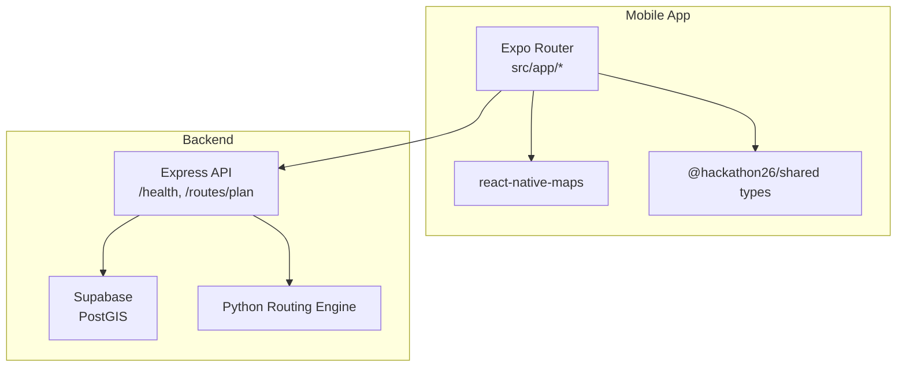
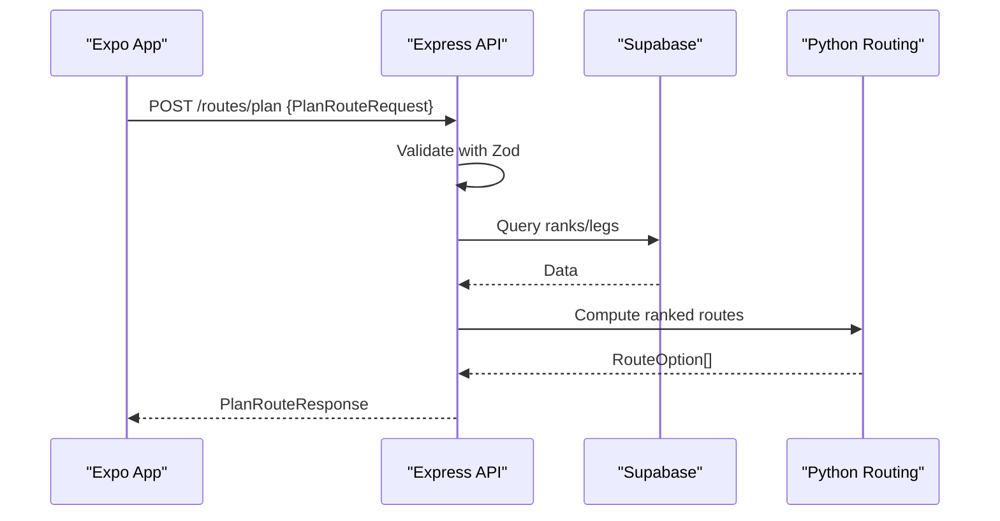
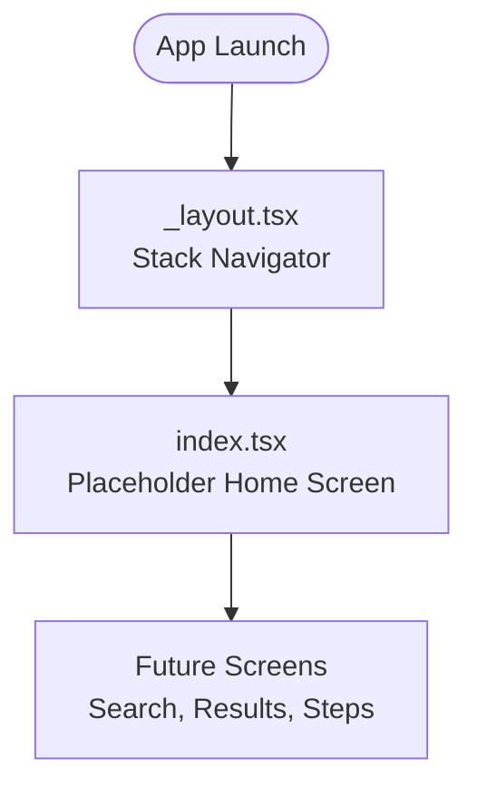
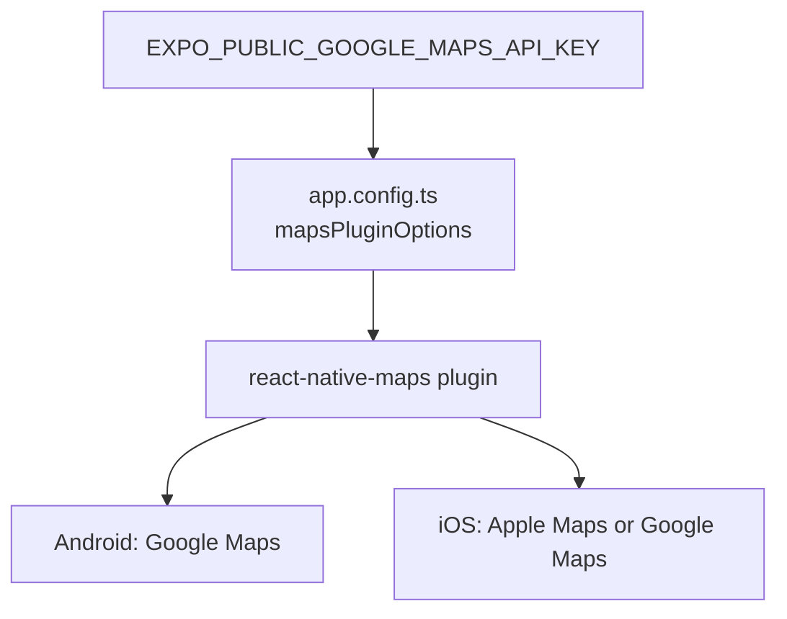
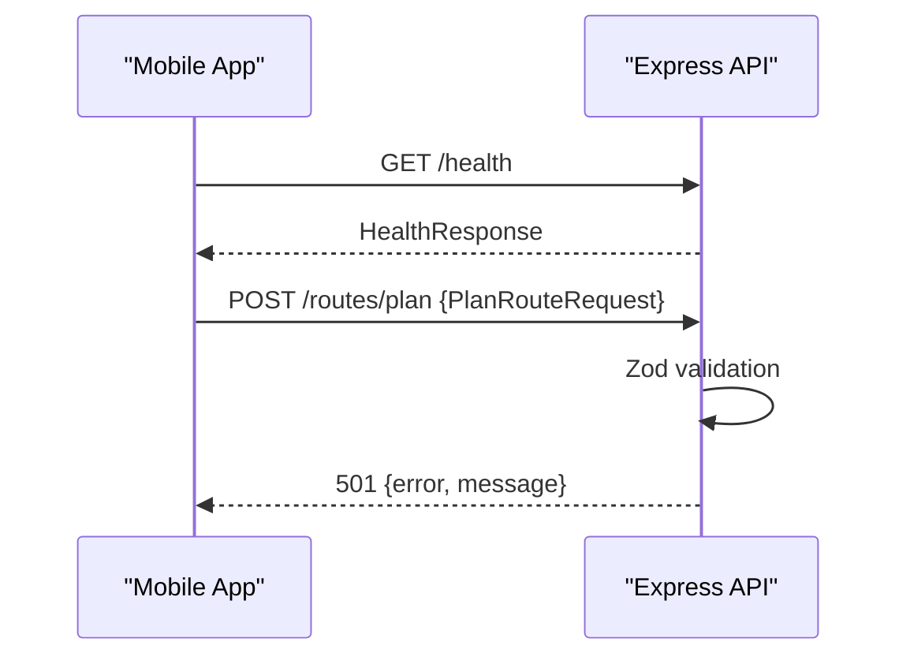
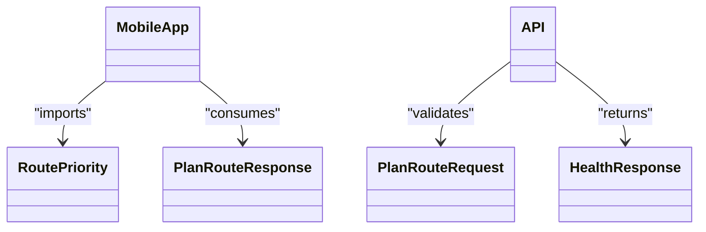
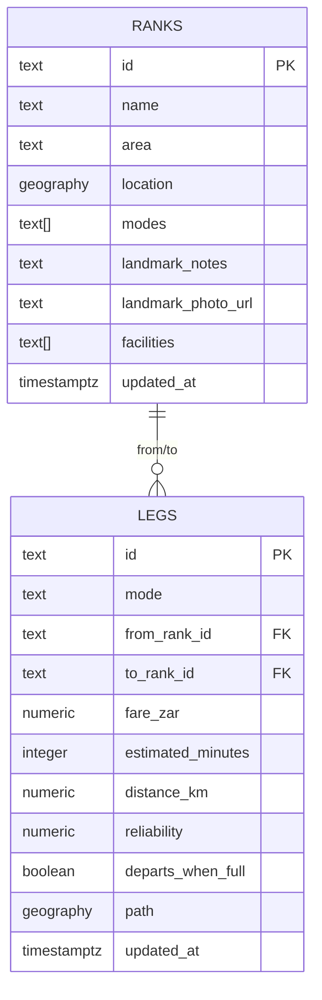
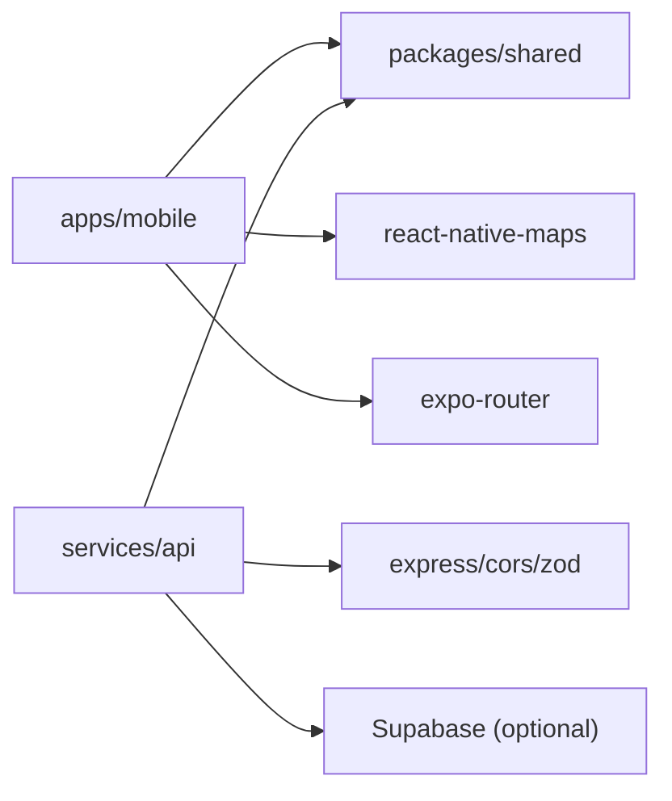

# Mobile Application

<cite>
**Referenced Files in This Document**
- [app.config.ts](file://apps/mobile/app.config.ts)
- [package.json](file://apps/mobile/package.json)
- [_layout.tsx](file://apps/mobile/src/app/_layout.tsx)
- [index.tsx](file://apps/mobile/src/app/index.tsx)
- [index.ts](file://packages/shared/src/index.ts)
- [index.ts](file://services/api/src/index.ts)
- [config.ts](file://services/api/src/config.ts)
- [0001_init.sql](file://supabase/migrations/0001_init.sql)
- [ARCHITECTURE.md](file://docs/ARCHITECTURE.md)
- [README.md](file://README.md)
</cite>

## Table of Contents
1. [Introduction](#introduction)
2. [Project Structure](#project-structure)
3. [Core Components](#core-components)
4. [Architecture Overview](#architecture-overview)
5. [Detailed Component Analysis](#detailed-component-analysis)
6. [Dependency Analysis](#dependency-analysis)
7. [Performance Considerations](#performance-considerations)
8. [Troubleshooting Guide](#troubleshooting-guide)
9. [Conclusion](#conclusion)
10. [Appendices](#appendices)

## Introduction
TransitGuide is a mobile application built with Expo and React Native that provides step-by-step navigation guidance for public transport commuters. It helps users find the right ranks to board, where to transfer, how much each leg costs, how much cash to carry, and which route best fits their priorities (cheapest, fastest, easiest, safest). The app uses Expo Router for file-based navigation, react-native-maps for map rendering, and communicates with a backend API that validates requests and will eventually compute routes using a Python graph engine.

The mobile app is the user-facing product; all journey logic and data access are intentionally kept behind the API so fare rules and routing strategies can evolve without requiring app updates.

**Section sources**
- [README.md:1-10](file://README.md#L1-L10)
- [ARCHITECTURE.md:1-24](file://docs/ARCHITECTURE.md#L1-L24)

## Project Structure
At a high level, the repository is organized as a monorepo:
- apps/mobile: Expo Router-based React Native app
- packages/shared: TypeScript-only domain types shared by the app and API
- services/api: Express REST API that validates requests and orchestrates routing
- services/routing: Python graph engine (not yet wired into the request path)
- supabase: Postgres + PostGIS migrations
- data/seed: Illustrative sample data for development

**Diagram sources**
- [ARCHITECTURE.md:26-41](file://docs/ARCHITECTURE.md#L26-L41)
- [package.json:5-17](file://apps/mobile/package.json#L5-L17)
- [index.ts:29-74](file://services/api/src/index.ts#L29-L74)

**Section sources**
- [ARCHITECTURE.md:14-24](file://docs/ARCHITECTURE.md#L14-L24)
- [README.md:121-131](file://README.md#L121-L131)

## Core Components
- Navigation: Expo Router with a root Stack navigator defined in the layout file. Each file under src/app becomes a screen; currently there is an index screen acting as a placeholder home.
- Maps: react-native-maps integrated via a config plugin that injects Google Maps keys at build time for Android and iOS.
- Shared Types: All domain models (Rank, Leg, RouteOption, PlanRouteRequest, etc.) live in packages/shared and are imported by both the mobile app and the API to keep contracts in sync.
- API Integration: The app’s future screens will call POST /routes/plan with a PlanRouteRequest and consume PlanRouteResponse. Currently the API validates inputs and returns a 501 stub.

Key responsibilities:
- _layout.tsx sets up the root navigator and status bar.
- index.tsx demonstrates type usage from @hackathon26/shared and serves as a placeholder until full screens are implemented.
- app.config.ts configures the app identity, deep link scheme, platform settings, and maps plugin options.
- package.json declares dependencies including expo-router, react-native-maps, and the shared workspace package.

**Section sources**
- [_layout.tsx:1-18](file://apps/mobile/src/app/_layout.tsx#L1-L18)
- [index.tsx:1-27](file://apps/mobile/src/app/index.tsx#L1-L27)
- [app.config.ts:1-64](file://apps/mobile/app.config.ts#L1-L64)
- [package.json:5-17](file://apps/mobile/package.json#L5-L17)
- [index.ts:10-142](file://packages/shared/src/index.ts#L10-L142)

## Architecture Overview
The intended request flow is:
- The mobile app sends a POST /routes/plan request with origin, destination, optional departure time, and priorities.
- The API validates the request body against Zod schemas aligned with the shared types.
- The API will query Supabase (ranks, legs) and optionally call the Python routing engine to compute ranked journeys.
- The API responds with a PlanRouteResponse containing multiple RouteOption entries and metadata.

**Diagram sources**
- [ARCHITECTURE.md:26-41](file://docs/ARCHITECTURE.md#L26-L41)
- [index.ts:21-67](file://services/api/src/index.ts#L21-L67)

**Section sources**
- [ARCHITECTURE.md:26-41](file://docs/ARCHITECTURE.md#L26-L41)
- [index.ts:21-67](file://services/api/src/index.ts#L21-L67)

## Detailed Component Analysis

### Expo Router Navigation
- Root layout defines a Stack navigator and registers the index screen with a title.
- Every file under src/app is treated as a route; adding new files automatically creates new screens.
- The current setup is minimal and ready to expand into search, results, and step-by-step guidance screens.

**Diagram sources**
- [_layout.tsx:8-17](file://apps/mobile/src/app/_layout.tsx#L8-L17)
- [index.tsx:10-27](file://apps/mobile/src/app/index.tsx#L10-L27)

**Section sources**
- [_layout.tsx:1-18](file://apps/mobile/src/app/_layout.tsx#L1-L18)
- [ARCHITECTURE.md:92-94](file://docs/ARCHITECTURE.md#L92-L94)

### Map Rendering and Platform Configuration
- react-native-maps is used for displaying transit routes and locations.
- Google Maps API key injection:
  - The config reads EXPO_PUBLIC_GOOGLE_MAPS_API_KEY from environment variables.
  - If present, it sets androidGoogleMapsApiKey and iosGoogleMapsApiKey for the maps plugin.
- Android requires a valid key; otherwise the map renders a blank grid.
- iOS uses Apple Maps when no Google Maps key is provided.

**Diagram sources**
- [app.config.ts:11-17](file://apps/mobile/app.config.ts#L11-L17)
- [app.config.ts:45-57](file://apps/mobile/app.config.ts#L45-L57)

**Section sources**
- [app.config.ts:1-64](file://apps/mobile/app.config.ts#L1-L64)
- [README.md:110-119](file://README.md#L110-L119)

### State Management Patterns
- The current home screen imports RoutePriority from the shared types and renders example tags to demonstrate type integration.
- For future stateful features (search form, selected route, step-by-step navigation), consider:
  - Local component state for transient UI state.
  - Context or a lightweight store for cross-screen state such as selected route option or active step.
  - Avoid global mutation unless necessary; prefer unidirectional data flow from API responses to UI state.

**Section sources**
- [index.tsx:1-27](file://apps/mobile/src/app/index.tsx#L1-L27)
- [index.ts:74-94](file://packages/shared/src/index.ts#L74-L94)

### Backend API Integration
- Request contract:
  - POST /routes/plan accepts PlanRouteRequest with origin, destination, optional departAt, and optional priorities array.
  - Validation is enforced with Zod schemas mirroring the shared types.
- Response contract:
  - PlanRouteResponse includes planId, labels, options, and generatedAt.
- Current behavior:
  - The endpoint validates input successfully but returns a 501 with a message indicating the route planning is not yet implemented.
- Health check:
  - GET /health returns status, uptimeSeconds, and dataSource (supabase or fixtures).

**Diagram sources**
- [index.ts:35-42](file://services/api/src/index.ts#L35-L42)
- [index.ts:51-67](file://services/api/src/index.ts#L51-L67)

**Section sources**
- [index.ts:21-67](file://services/api/src/index.ts#L21-L67)
- [index.ts:120-142](file://packages/shared/src/index.ts#L120-L142)

### Domain Types Consumption
- The mobile app imports RoutePriority from @hackathon26/shared to ensure consistent enums across UI and backend.
- The API also imports PlanRouteRequest and HealthResponse from the same package, guaranteeing type alignment between client and server.

**Diagram sources**
- [index.tsx:1-2](file://apps/mobile/src/app/index.tsx#L1-L2)
- [index.ts:120-142](file://packages/shared/src/index.ts#L120-L142)
- [index.ts:5](file://services/api/src/index.ts#L5)

**Section sources**
- [index.tsx:1-2](file://apps/mobile/src/app/index.tsx#L1-L2)
- [index.ts:120-142](file://packages/shared/src/index.ts#L120-L142)
- [index.ts:5](file://services/api/src/index.ts#L5)

### Database Schema and Spatial Queries
- The migration enables PostGIS and defines tables for ranks, legs, and fare snapshots.
- A spatial function ranks_within supports nearest-rank queries based on latitude/longitude and radius.
- Row-level security policies allow public read access for ranks and legs.

**Diagram sources**
- [0001_init.sql:8-44](file://supabase/migrations/0001_init.sql#L8-L44)

**Section sources**
- [0001_init.sql:1-105](file://supabase/migrations/0001_init.sql#L1-L105)

## Dependency Analysis
- Mobile app depends on:
  - expo-router for navigation
  - react-native-maps for maps
  - @hackathon26/shared for domain types
  - expo-* utilities for constants, linking, status bar
- API depends on:
  - express, cors, zod for request handling and validation
  - @hackathon26/shared for shared types
  - Optional Supabase credentials for data access

**Diagram sources**
- [package.json:5-17](file://apps/mobile/package.json#L5-L17)
- [index.ts:5](file://services/api/src/index.ts#L5)
- [config.ts:3-12](file://services/api/src/config.ts#L3-L12)

**Section sources**
- [package.json:5-17](file://apps/mobile/package.json#L5-L17)
- [index.ts:5](file://services/api/src/index.ts#L5)
- [config.ts:3-12](file://services/api/src/config.ts#L3-L12)

## Performance Considerations
- Keep network requests efficient: batch route planning calls and avoid redundant requests during navigation steps.
- Use memoization for expensive computations in UI components (e.g., formatting fares, building step lists).
- Prefer lazy loading for heavy screens (map-heavy detail views) to reduce initial bundle size and startup time.
- Cache frequently accessed reference data (ranks, nearby points) locally if appropriate, while ensuring consistency with API updates.

[No sources needed since this section provides general guidance]

## Troubleshooting Guide
Common issues and resolutions:

- Native module linking and maps rendering:
  - react-native-maps contains native code; Expo Go cannot run it. Build a development client once using npx expo run:android or use cloud builds with eas-cli.
  - On Android, a missing or invalid Google Maps API key results in a blank map grid. Ensure EXPO_PUBLIC_GOOGLE_MAPS_API_KEY is set and rebuild the dev client.
  - iOS uses Apple Maps by default; no API key required unless you explicitly configure Google Maps.

- Development server setup:
  - Start the API in one terminal and the Expo dev server in another. Verify API health with a GET /health call.
  - If OneDrive sync interferes, move the project outside synced folders to avoid file locks and slow installs.

- Environment configuration:
  - Copy .env.example files for both services/api and apps/mobile, then fill in SUPABASE_URL and SUPABASE_SERVICE_ROLE_KEY for the API. These files are gitignored and should never be committed.
  - For local development, the API defaults to port 4000 unless overridden by PORT.

- Type mismatches:
  - Because packages/shared is types-only, any drift between app and API is caught at compile time. Re-run typecheck to catch inconsistencies early.

**Section sources**
- [README.md:91-119](file://README.md#L91-L119)
- [README.md:151-169](file://README.md#L151-L169)
- [app.config.ts:11-17](file://apps/mobile/app.config.ts#L11-L17)
- [config.ts:3-12](file://services/api/src/config.ts#L3-L12)

## Conclusion
TransitGuide’s mobile app provides a foundation for step-by-step public transport navigation using Expo Router, react-native-maps, and shared TypeScript domain types. The architecture keeps routing logic and data access behind a validated API, enabling safe evolution of fare rules and ranking strategies. With proper environment configuration and a development build, maps render correctly on both platforms. As screens and state management mature, the app will deliver actionable guidance for first-time long-distance commuters.

[No sources needed since this section summarizes without analyzing specific files]

## Appendices

### Environment Variables
- apps/mobile/.env:
  - EXPO_PUBLIC_GOOGLE_MAPS_API_KEY: Injected at build time for react-native-maps on Android and iOS.
- services/api/.env:
  - SUPABASE_URL: Supabase project URL.
  - SUPABASE_SERVICE_ROLE_KEY: Service role key for database access.
  - PORT: API listening port (defaults to 4000).

**Section sources**
- [README.md:32-41](file://README.md#L32-L41)
- [app.config.ts:11-17](file://apps/mobile/app.config.ts#L11-L17)
- [config.ts:3-12](file://services/api/src/config.ts#L3-L12)

### Build Processes
- Local development:
  - Install dependencies from the repository root.
  - Run the API and Expo dev server in separate terminals.
  - Build a development client for maps support on Android or iOS.
- Cloud builds:
  - Use eas-cli to build a development profile for Android without a local toolchain.

**Section sources**
- [README.md:73-108](file://README.md#L73-L108)